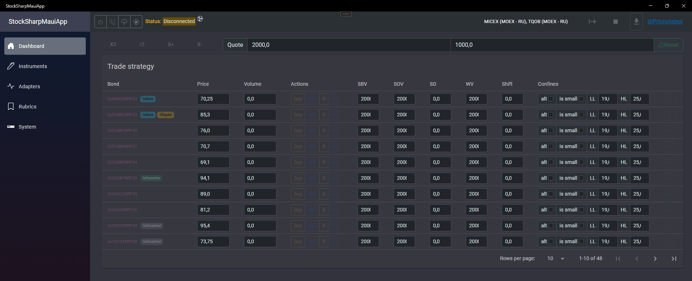

## Интеграция StockSharp

Клиент-серверное решение, совместимое с BlankCRM, но имеет собственный/нативный (локальный: win/android/ios/macos/tizen) клиент. Лицензия на [StockSharp](https://stocksharp.ru/?rf=202744) приобретается отдельно.

Управление подключением

- прежде чем подключаться - следует настроить адаптеры

Торговля

Адаптеры

Инструменты

Логирование заимствовано из BlankCRM

- Драйвер (BackEnd служба): net6 решение взаимодействует с StockSharp, логирование, транслирует события в MQTT и отвечает входящие запросы (извне). +TelegramBot, а так же встроенный MQTT сервер (на случай отсутствия отдельного/автономного mqtt сервиса).
- MAUI-Blazor клиент: net9 GUI решение, которое взаимодействует с драйвером через MQTT

#### StockSharpDriver +TelegramBot
Встроенный MQTT сервер, но можно использовать любой MQTT v5. По умолчанию используется localhost:1883, но можно настроить по своему усмотрению.
С точки зрения событий - транслирует их все в MQTT, что бы любой клиент мог прослушать его. Изолирует "нежелательные" зависимости из оригинальной сборки StockSharp, но и не совместим с оригинальными решениями от StockSharp (Гидра, Дизайнер и т.д.).
Встроены TelegramBot для доступа к сервису и оповещений.

#### MAUI-Blazor клиент
Демонстрация взаимодействия клиента с драйвером StockSharp (over MQTT). Чистый проект без зависимостей от StockSharp (net6, wpf, etc ...).
Открытый исходный код заготовки для торгового бота через StockSharp коннектор.