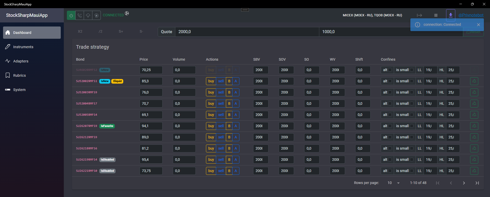
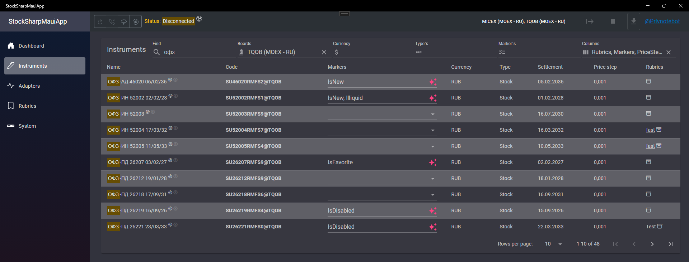
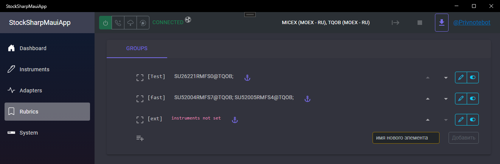
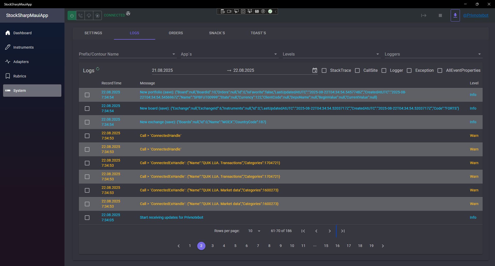

## StockSharp - integration (over mqtt) - starter case

Client-server solution compatible with BlankCRM, but has its own/native (local: win/android/ios/macos/tizen) client. The license for the  [StockSharp](https://stocksharp.ru/?rf=202744) is purchased separately.

Trade

Connection management

- Before connecting, you should configure the adapters

Adapters

Instruments (aka Securities)

Manage

Rubrics (segments)

System (configs)

Logs (imported of BlankCRM)

- Dreiver (BackEnd service): net6 solution interacts with StockSharp, logging, broadcasts events in MQTT and responds to incoming requests (from the outside). +TelegramBot, as well as a built-in MQTT server (in case there is no separate/autonomous mqtt service).
- MAUI-Blazor client: net 9 GUI solution that communicates with the driver via MQTT

#### StockSharpDriver +TelegramBot
Built-in MQTT server, but you can use any MQTT v5. By default, localhost:1883 is used, but you can configure it as you wish.
In terms of events - broadcasts them all in MQTT so that any client can listen to it. Isolates "unwanted" dependencies from the original StockSharp build, but is also not compatible with the original StockSharp solutions (Hydra, Designer, etc.).
Built-in TelegramBot for access to the service and notifications.

#### MAUI-Blazor client
Demonstration of client interaction with StockSharp driver (over MQTT). Clean project without StockSharp dependencies (net6, wpf, etc ...).
Open source code for a trading bot template via StockSharp connector.